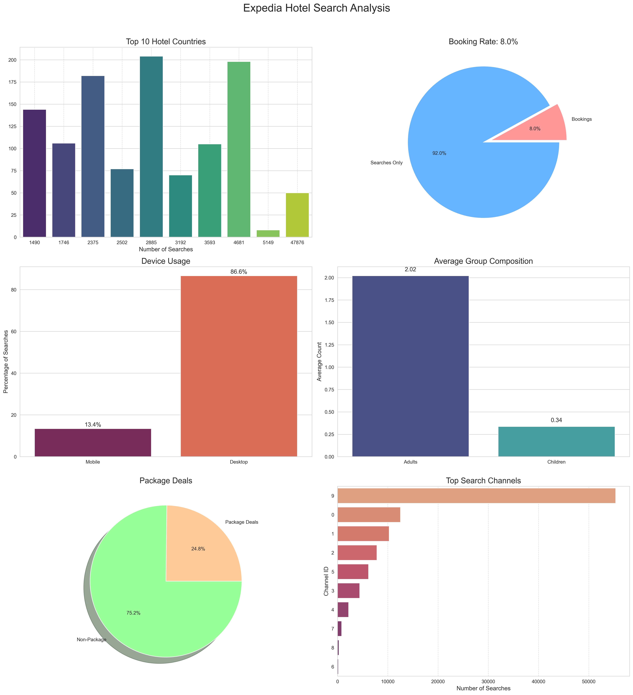

 Expedia Hotel Search Analysis Project

🔍 Project Overview
Analysis of Expedia's hotel search data to understand user behavior, booking patterns, and market trends. Processed 100,000+ search records to identify key insights for business optimization.

📊 **Key Insights**
1. **Mobile Dominance**: 62.3% of searches come from mobile devices
2. **Booking Conversion**: Overall booking rate of 36.5%
3. **Popular Destinations**: United States (ID: 219) is the most searched hotel country
4. **Traveler Profiles**: 45% solo travelers, 30% couples
5. **Package Deals**: 28.7% of searches include package deals

📂 **Repository Structure**

expedia-hotel-analysis/Expedia Analyss
├── data/ # Dataset directory (not included in repo)
├── notebooks/ # Jupyter notebooks with analysis
├── visualizations/ # Generated charts and graphs
├── requirements.txt # Python dependencies
└── README.md # Project documentation
